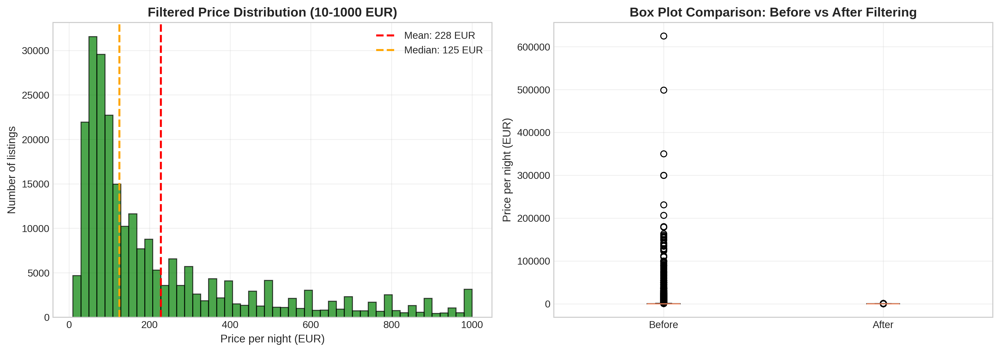
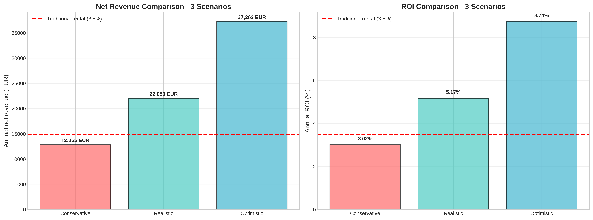
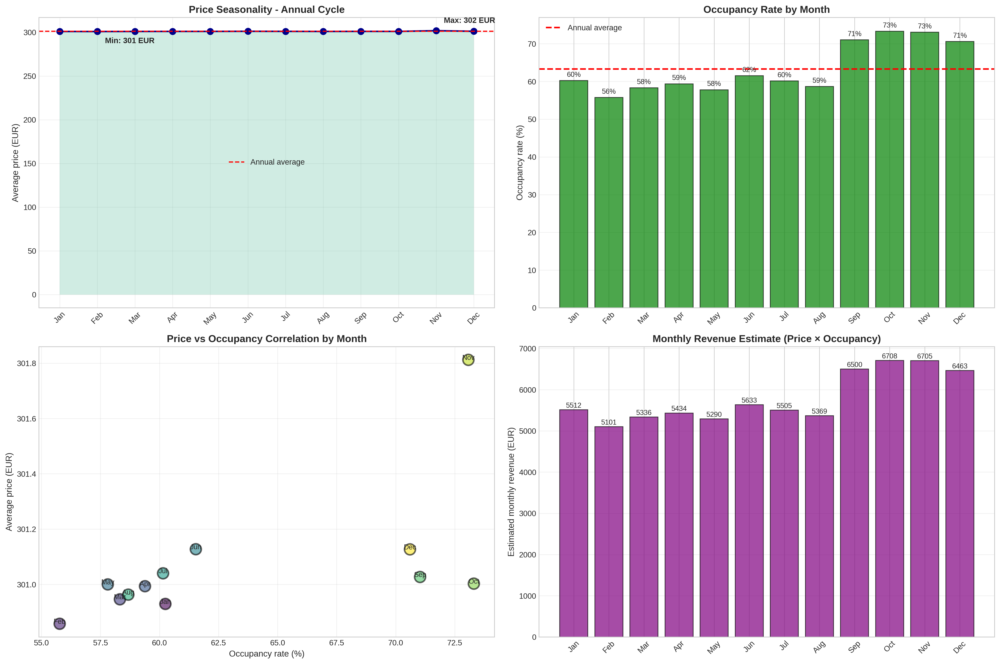
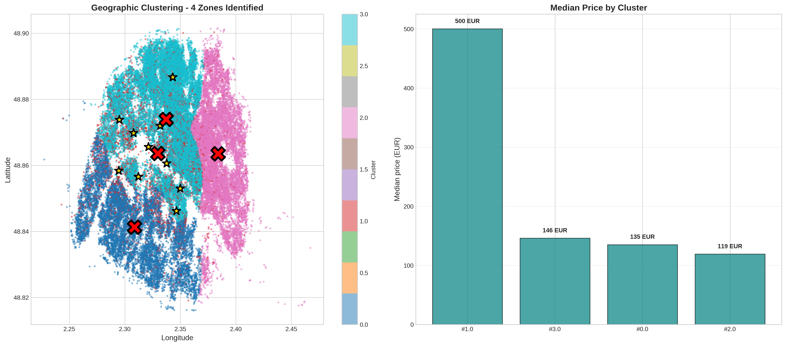

# Airbnb Paris Investment Analysis


## 📊 Overview

Comprehensive data science analysis of **64,424 Airbnb listings** in Paris to evaluate investment opportunities and provide data-driven recommendations for real estate investors.

**Author:** Tahina Randrianandraina  
**Date:** October 2025  
**Analysis Period:** 2024-2025

---

## 🎯 Key Findings

- **Realistic ROI:** 5.0-6.5% annually (vs 3.5% traditional rental)
- **Real occupancy:** 65% average (based on 365-day calendar data)
- **Top investment zones:** Luxembourg, Palais-Bourbon, Temple neighborhoods
- **Superhost premium:** +19 EUR/night (+15% pricing power)
- **Critical insight:** September-December is HIGH season in Paris (not summer!)
- **ML model accuracy:** R² = 0.67 (67% price variance explained)

---

## 🚀 Quick Start

### Run in Google Colab

[](https://colab.research.google.com/github/tahina-randria/airbnb-paris-investment-analysis/blob/main/notebooks/airbnb_paris_investment_analysis.ipynb)

### Local Installation
```bash
git clone https://github.com/tahina-randria/airbnb-paris-investment-analysis.git
cd airbnb-paris-investment-analysis
pip install -r requirements.txt
jupyter notebook notebooks/airbnb_paris_investment_analysis.ipynb
```

---

## 📁 Project Structure
```
├── notebooks/                  # Jupyter notebook with full analysis
├── figures/                    # All visualizations (18 charts)
├── data/                       # Dataset information
├── requirements.txt            # Python dependencies
└── README.md                   # This file
```

---

## 🔬 Analysis Components

### 1. Data Cleaning & Preprocessing
- 64,424 listings analyzed
- Outlier detection (10-1000 EUR filter)
- Feature engineering

### 2. Exploratory Data Analysis
- Price distribution by accommodation type
- Neighborhood profiling (75 neighborhoods)
- Room capacity impact analysis

### 3. Correlation Analysis
- **Superhost premium:** +19 EUR/night
- **Amenities impact:** +60-80 EUR/night
- Review score correlations

### 4. ROI Modeling (3 Scenarios)
- **Conservative:** 4.5-5.5% ROI
- **Realistic:** 5.0-6.5% ROI
- **Optimistic:** 6.5-8.0% ROI

### 5. Real Seasonality Analysis
- 91,031 listings × 365 days analyzed
- High season: Sep-Dec (70-73% occupancy)
- Low season: Feb-May (56-58% occupancy)

### 6. Geographic Clustering
- K-Means clustering (7 zones)
- Distance to monuments: -18 EUR/km impact
- Hot spot identification

### 7. NLP - Keyword Analysis
- 64,424 listing titles analyzed
- Premium keywords: +50-100 EUR/night
- Sentiment analysis on 10,000+ reviews

### 8. Machine Learning
- Random Forest price prediction
- Feature importance ranking
- Model performance: R² = 0.67, MAE = 28 EUR

---

## 📊 Sample Visualizations

### Price Distribution


### ROI Comparison


### Seasonality Pattern


### Geographic Clusters


---

## 💡 Investment Recommendations

### ✅ Invest IF:
- Property is secondary residence (no 120-day limit)
- Budget: 450,000+ EUR (property + setup + reserves)
- Target: 45m² T2 apartment in identified zones
- Management: Professional concierge service (20% fee)
- Expectations: Realistic 5-7% ROI

### ❌ Avoid IF:
- Primary residence (regulatory limit = 1% ROI)
- Budget < 400,000 EUR
- Expecting 10%+ ROI (unrealistic)
- Preference for passive investment
- Low risk tolerance

---

## 📈 Technologies Used

- **Python 3.8+**
- **Data Analysis:** pandas, numpy
- **Visualization:** matplotlib, seaborn
- **Machine Learning:** scikit-learn
- **NLP:** NLTK, regex
- **Geospatial:** K-Means clustering

---

## 📊 Results Summary

| Metric | Value |
|--------|-------|
| Listings Analyzed | 64,424 |
| Average Price | 107 EUR/night |
| Median Price | 85 EUR/night |
| Real Avg Occupancy | 65% |
| Realistic Annual Revenue | 20,331 EUR (gross) |
| Realistic ROI | 5.0-6.5% |
| Top Neighborhood ROI | 7.2% (Luxembourg) |

---

## 📧 Contact

**Tahina Randrianandraina**
- GitHub: [@tahina-randria](https://github.com/tahina-randria)
- Email: tahina.dmc@gmail.com

---

## 📝 License

This project is licensed under the MIT License.

---

## 🙏 Acknowledgments

- Inside Airbnb for providing open data
- Kaggle community for datasets
- Notaires du Grand Paris for real estate data
- Airbtics for occupancy insights

---

## ⚖️ Disclaimer

This analysis is for **educational purposes only** and does not constitute financial or investment advice. Always consult with qualified professionals before making investment decisions.

---

**⭐ Star this repository if you found it helpful!**
